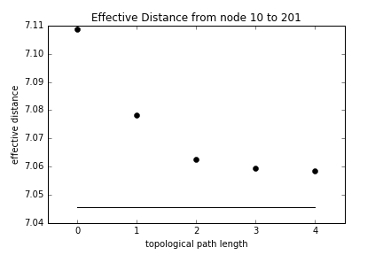

# Effective Distances on Complex Networks

The effective distance is an alternative distance metric, which takes into account the local topology of the network and the fluxes along the edges. It has been introduced to predict the time that an infection needs in order to spread from a given source node to a specific target.
The different approaches are based on the intuition, that large fluxes and few neighbours decrease the transmission time to an adjacent node.

We provide a set of methods, which allow to compare different approaches:

#### 1. Pathogens can spread along multiple paths
Gautreau, A., Barrat, A. and Barthelemy, M., _Global disease spread: Statistics and estimation of arrival times_, J. Theor. Biol. __251__, 3, 509 (2008)

#### 2. Only the most dominant path is considered
Gautreau, A., Barrat, A. and Barthelemy, M., _Global disease spread: Statistics and estimation of arrival times_, J. Theor. Biol. __251__, 3, 509 (2008)  
Brockmann, D. and Helbing, D., _The hidden geometry of complex, network-driven contagion phenomena_, Science __342__, 6164, 1337 (2013)

#### 3. Random Walk based approach
Iannelli, F., Koher, A., Hoevel, P. and Sokolov, I.M. _Effective Distances in Complex Networks_ (in preparation)

---
# Required Software

Please download the files either using the [link](https://gitlab.tubit.tu-berlin.de/hoevel_group/effective_distance/repository/archive.zip "Download all files.") or, open a terminal and type

```
git clone git@gitlab.tubit.tu-berlin.de:hoevel_group/effective_distance.git 
```
The user name and password are the same as for the TUBIT account.

The package uses functionalities from numpy, scipy and networkx. You can check your versions against those, which I used by executing the script in your terminal:

```
$: python effective_distance


Effective Distances
---------
Required modules:
Python:   tested for: 2.7.11.  Yours: 2.7.11
numpy:    tested for: 1.11.0.  Yours: 1.11.0
scipy:    tested for: 0.17.0.  Yours: 0.17.0
networkx: tested for: 1.9.1.   Yours: 1.9.1
```

If your version differs, it is still likely to work anyway.

---
# Step 1: Import the package

In order to import the package into your python program, you can put the files into the same directory.
Alternatively, make them visible to python by adding the directory to the `PYTHONPATH` variable or enter the following command to the beginning of your python script: 
```python
from sys import path
path.append('<directory/to/effective_distance.py>')
```
We can now import the package into the python programm:
```python
import effective_distance as ed
```

---
# Step 2: Load the network


We assume, that the mobility network is stored in a comma separated file (.csv) following the convention SOURCE, TARGET, FLUX. The node IDs are interpreted as integers and have to run from 0 to number_of_nodes - 1. The fluxes have to be positive and will be saved as float numbers.
```python
myEffectiveDistance = ed.EffectiveDistances("data/US_largest500_airportnetwork.csv")
```
The graph is now stored in the attribute myEffectiveDistance.graph as a NetworkX type DiGraph. In order to avoid singularities in later calculations, the giant strongly connected component has been stored only.

# Step 3: Effective Distances

We provide three methods to calculate the effective distance, as introduced in the beginning. If the source and target is specified a number is returned. Otherwise, if one is set to `None` or both an array is returned.

```python
source, target = 0, 100

# Dominant path effective distance
DPED = myEffectiveDistance.get_dominant_path_distance(source, target)

# Multiple path effective distance with different cut-off lengths
cutoff = range(5)
MPED = []
for c in cutoff:
    MPED.append(
        myEffectiveDistance.get_multiple_path_distance(source, target, cutoff=c) #ATTENTION: source = target = None can take a couple of days... So you better enjoy a long weekend now.
        )

#Random walk effective distance
RWED = myEffectiveDistance.get_random_walk_distance(source, target)
```

# Step 4: Plot the results

The commonly used matplotlib package offers all we need. It is not a feast for the eyes, but serves us well enough:

```python
import matplotlib.pyplot as plt
%matplotlib inline

plt.plot(0,DPED, 'r*')
plt.plot(cutoff,MPED, 'ko')
plt.plot([0,cutoff[-1]], [RWED,RWED], 'k-')
plt.xlim(left=cutoff[0]-.5, right=cutoff[-1]+.5)
plt.xlabel("topological path length")
plt.ylabel("effective distance")
plt.title("Effective Distance from node "+str(source)+" to "+str(target))
plt.show()
```

 
